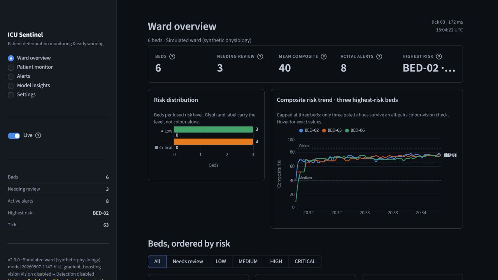
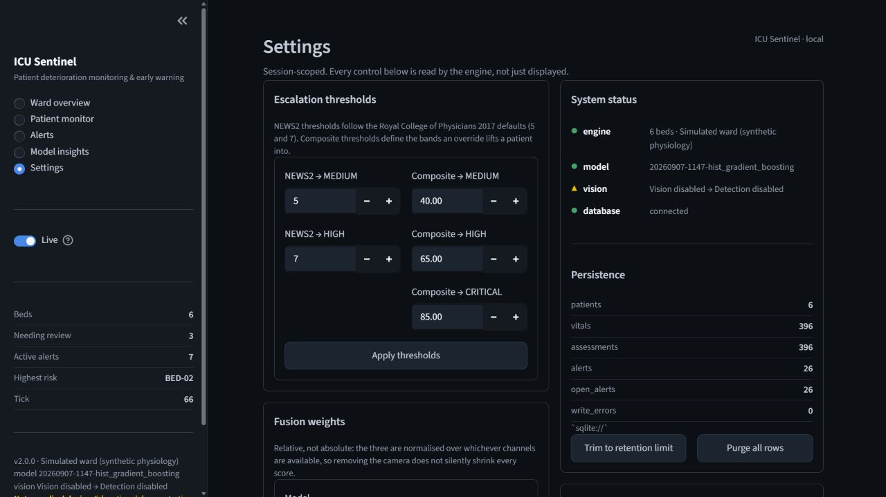

# ICU Sentinel

**Real-time ICU deterioration monitoring: a published clinical early-warning score, a machine-learning acuity model, and a bedside vision channel, fused into one explainable risk number per bed.**

[](https://github.com/gunargrithvick/icu-patient-risk-monitoring-system/actions/workflows/ci.yml)
[](https://www.python.org/downloads/)
[](LICENSE)
[](tests/)

> **Not a medical device.** This is a research and teaching project. No threshold here has been calibrated against a real ward, and the model is trained on a public retrospective cohort. See [Limitations](#limitations).

---

## Live API

Try the deployed FastAPI service: [ICU Patient Risk Monitoring System API](https://icu-patient-risk-monitoring-system.vercel.app/).

The public health, readiness, metrics, and interactive documentation probes are available without credentials. The operational `/api/v1` routes require the deployment's private `X-API-Key`; it is intentionally not published in this repository. The production deployment uses the connected Neon PostgreSQL database and synthetic ward data, so it is suitable for evaluation—not clinical use.

## Screenshots

These captures show the current Streamlit dashboard in reproducible local simulator mode (`ICU_FRAME_SOURCE=off`, `ICU_DETECTOR=off`). They use synthetic ward data and are provided for evaluation only.

### Ward overview



### Settings and readiness



The screenshots are documentation images of the dashboard. The deployed [Vercel API](https://icu-patient-risk-monitoring-system.vercel.app/) is the public hosted service; run the Streamlit dashboard locally, with Docker, or through Streamlit Community Cloud as described in [Quickstart](#quickstart).

## What it does

Three independent channels look at each bed, and one fusion layer combines them into a 0–100 composite score and a risk band:

| Channel | What it is | Weight | When it is missing |
|---|---|---|---|
| **NEWS2** | The Royal College of Physicians National Early Warning Score 2, implemented from the published table — seven parameters, both SpO₂ scales, the graded clinical response | 0.40 | Never: it needs no model and no camera |
| **Model** | A histogram gradient-boosting classifier over 51 window features, returning `LOW`/`MEDIUM`/`HIGH` with probability estimates | 0.45 | Reported as unavailable; the score is computed from the other channels |
| **Vision** | Patient presence, posture and motion from a camera — bed-exit and fall signals | 0.15 | Reported as unavailable; **never** treated as "all clear" |

Two properties make this more than a weighted average:

**Weights are renormalised over the channels that actually reported.** A ward with no trained model does not silently score every patient 45 % lower — it scores them on NEWS2 and vision, and says so. A missing camera is missing information, not reassurance, exactly as a missing SpO₂ reading is not 98 %.

**A published score can veto the model.** Clinical override rules impose a hard floor on the composite: a NEWS2 of 7, a single red parameter, or an extreme value lifts the band regardless of what the model believes. The floor still ranks patients *within* the band it lifts them into, so triage order survives the override. When the two disagree, the validated instrument wins — and the dashboard names the rule that bound.

**Every score is itemised.** The patient view shows the NEWS2 parameters that fed it, the fusion contributions that sum to it, the model's class probabilities, and any override that lifted it. A clinician who disagrees with the number can see which input to argue with.

---

## Quickstart

Four paths, in increasing order of setup. The local, Docker, and hosted dashboard paths work with **no camera, no GPU, no dataset, and no trained model** — the system is designed to degrade visibly rather than fail. Vercel hosts the API surface, not the Streamlit dashboard; that distinction is intentional and documented below.

### 1. Locally, with pip

```bash
python -m venv .venv
# Windows PowerShell: .venv\Scripts\Activate.ps1
# macOS/Linux:        source .venv/bin/activate
python -m pip install -e ".[dev]"
```

The editable install keeps generated data beside this checkout. If you install a built wheel
instead, data defaults to the directory from which you launch the command; set `ICU_PROJECT_ROOT`
when you want an explicit data location.

The module form works consistently on Windows, macOS, and Linux and does not depend on the
console-script directory being on `PATH`: `python -m icu_monitor <command>`.

```bash
python -m icu_monitor dashboard
```

The dashboard opens on <http://localhost:8501>. Nothing else is required: the ward is simulated, the camera falls back to a synthetic ward-bay scene, and the risk score runs on NEWS2 until a model exists.

Want a model? One command builds a dataset with the simulator and trains on it:

```bash
python -m icu_monitor etl --synthetic --stays 900 && python -m icu_monitor train
```

No browser at all — print the ward to the terminal:

```bash
python -m icu_monitor tick --ticks 12
```

### 2. With Docker

```bash
docker compose up -d
```

Dashboard on <http://localhost:8501>, API docs on <http://localhost:8000/docs>. Both ports are bound to `127.0.0.1` on purpose — see [Security](#security).

Optionally seed a dataset and a model into the volumes first:

```bash
docker compose --profile setup run --rm bootstrap
```

### 3. Hosted Streamlit

Point Streamlit Community Cloud at [`app.py`](app.py). The committed [`requirements.txt`](requirements.txt) delegates runtime dependencies to `pyproject.toml`, while the root shim keeps the `src/` layout runnable in hosted and direct-checkout environments. `.streamlit/config.toml` pins the dark theme the palette was validated against.

### 4. Vercel API

This repository is Vercel-ready for the FastAPI API. It is **not** a Streamlit-on-Vercel deployment: Vercel's [Python runtime](https://vercel.com/docs/functions/runtimes/python) runs request-driven Functions, while the dashboard needs Streamlit's long-running interactive server and WebSocket session. Deploy the dashboard through Streamlit Community Cloud or Docker, and use Vercel for the public API if that split suits the project. See [Vercel deployment](#vercel) for the required database and environment configuration.

---

## The dashboard

Five views, each answering one question. Every widget is a real Streamlit component wired to the engine — no HTML-in-markdown cards that look interactive and are not.

| View | The question it answers |
|---|---|
| **Ward Overview** | *Who needs me?* Beds ordered by composite score, never by bed number. A list sorted by bed is a filing system; the point of computing a composite is to be able to sort by it. |
| **Patient Monitor** | *Why this score?* One bed in full: NEWS2 parameter table, itemised fusion contributions, model probabilities, vitals trends, the camera frame with its detection box. |
| **Alerts** | *What is true now, and what has nobody seen?* **Active** (the condition holds) and **open** (raised, unacknowledged) are different sets and are never added together. |
| **Model Insights** | *How much should I trust the model?* Leads with what it gets wrong: per-class F1, the confusion matrix, calibration curve, permutation importances. |
| **Settings** | *What happens if I change this?* Every control rebuilds the engine with a new `Settings` object, so the number on screen is the number the fusion layer uses. Session-scoped; nothing is written to `.env`. |

The palette is not a matter of taste: the five categorical hues, the sequential ramp and the four ordinal risk colours were each run through a colour-vision-deficiency validator against the actual chart surface (`#141a21`), and the recorded ΔE figures are in [`ui/theme.py`](src/icu_monitor/ui/theme.py). Risk level is never communicated by colour alone — every badge carries a glyph and the level word, because the worst adjacent pair in the status palette sits in the band that is only legal with a secondary encoding.

Three conventions follow from that, and they are worth stating because they are the difference between a chart and a decoration:

- **Colour separates lines; text identifies them.** The risk timeline labels every line at its own end rather than relying on the legend, because a bed's hue is *not* stable when the tracked set changes. Measured over every three-bed subset of a twelve-bed ward, swapping one member repaints a third of the survivors — and no assignment does much better (a stable per-id hash with collision repair scores 71 % against this function's 67 %). A direct label cannot be wrong about which bed it names. Past three beds the view facets instead of reaching for a fourth hue, since only the first three palette entries survive an all-pairs colour-vision check.
- **A panel with nothing to draw says so in words.** No empty axes, and no chart drawn from placeholder values: with no trained artefact the class-probability panel prints *"No trained artefact loaded — scoring runs on NEWS2 and vision alone"* rather than three 0 % bars, which is what it used to do (the fusion layer returns a zero-filled class map, which is truthy). Same rule for a bed whose NEWS2 could not be scored, and for a provider that cannot be steered — the reason appears where the controls would have been, naming the provider, instead of the panel quietly disappearing.
- **Nothing on screen is a value the engine never produced.** The timeline's tooltip reports the composite score and not a risk level, because stored history carries scores while a level also depends on clinical overrides that are not replayed. Consciousness is rendered as the letter *and* the word — `A (Alert)`, `P (Responds to pain)` — since `A` is the notation on the paper NEWS2 chart but `V`, `P` and `U` are not self-evident to anyone reading over a clinician's shoulder; a bare stored string with no label degrades to the letter alone rather than inventing one. And every confirmation names its object: the reload toast names the model version, the injection toast names both the event and the bed it landed on.

### Simulator controls

The ward is a physiological simulator, not a random-number generator, and it is drivable. Set a patient's clinical state (`stable`, `recovering`, `deteriorating`, `critical`), toggle supplemental oxygen and the NEWS2 SpO₂ scale, or inject a timed event:

| Event | What it does to the physiology |
|---|---|
| `desaturation` | SpO₂ −9, respiratory rate +6, heart rate +12, over 24 minutes |
| `sepsis` | Temperature +1.6 °C, heart rate +24, systolic −22, respiratory rate +5, over 60 minutes |
| `haemorrhage` | Systolic −32, heart rate +30, SpO₂ −3, over 36 minutes |
| `arrhythmia` | Heart rate +46, systolic −14, over 18 minutes |
| `bradycardia` | Heart rate −40, systolic −10, over 18 minutes |
| `neuro` | GCS −5, respiratory rate −3, over 40 minutes |
| `recovery` | SpO₂ +4, heart rate −18, systolic +14, respiratory rate −5, over 48 minutes |

Each event ramps and decays rather than stepping, so NEWS2, the model's slope features and the alert cooldown all see a plausible trajectory.

---

## Alerting

Fourteen rules in three groups, de-duplicated by a cooldown so the same condition cannot re-fire every tick:

- **Physiology (8)** — hypoxaemia, tachycardia, bradycardia, hypotension, hypertension, tachypnoea, pyrexia, hypothermia. Each carries the reason it matters and what to check, and the message names the NEWS2 band it came from.
- **Bedside safety (3)** — suspected fall (recumbent posture outside the bed region, held for N consecutive frames), bed exit, patient absent.
- **System (3)** — NEWS2 threshold crossed, composite risk escalation, sensor failure. The last one is the honest admission that scoring is degraded until a channel returns.

Acknowledgement is idempotent and audited: the first signature wins, a repeat acknowledgement reports `acknowledged: 0` rather than claiming to have done something, and acknowledging records that a human *saw* the alert — it does not clear the condition.

---

## The HTTP API

The API is what makes this more than a screen: it is the integration point another system can score against, using the same NEWS2 implementation, the same fusion and the same model as the dashboard. Interactive schema at `/docs`.

Canonical casing is deliberate: risk levels in JSON and stored model classes are uppercase
(`LOW`, `MEDIUM`, `HIGH`, `CRITICAL`, `UNKNOWN`); clinical states and event slugs are
lowercase (`stable`, `deteriorating`, `desaturation`); and human-facing labels use title
case (`Low`, `Critical`, `Deteriorating`, `Desaturation episode`). Use the canonical forms
in requests and configuration even where a parser accepts an equivalent case.

### Operational — unauthenticated by design

| | |
|---|---|
| `GET /health` | Liveness. Cheap, dependency-free. |
| `GET /ready` | Per-component readiness. **Tolerant**: a missing model or database is reported but leaves the service ready — the system is designed to run on NEWS2 alone. Only a dead engine is a 503. |
| `GET /metrics` | Prometheus text format: bed counts per risk level, mean composite, active/open alerts, ticks, tick duration, tick errors, whether a model is loaded. |

### Stateless scoring — no ward state touched

| | |
|---|---|
| `POST /api/v1/risk/score` | Score one posted observation. |
| `POST /api/v1/risk/batch` | Up to 500 at once. |

```bash
curl -X POST http://localhost:8000/api/v1/risk/score \
  -H 'Content-Type: application/json' \
  -d '{"vitals":{"heart_rate":128,"spo2":89,"bp_systolic":86,"resp_rate":28,"temperature":38.9,"consciousness":"voice"},"spo2_scale":1}'
```

The response says plainly whether the model contributed. A single posted observation is not a *history*, and the model's features are window aggregates, so rather than fabricate a window the ML channel is asked only when the caller opts in and a model exists. A NEWS2-only answer is complete, not degraded.

`consciousness` accepts the ACVPU letter, the enum name, or a reasonable English spelling (`A`, `alert`, `awake`, `V`, `voice`, `verbal`, `C`, `confusion`, `confused`, `P`, `pain`, `painful`, `U`, `unresponsive`, `unconscious`). Anything else is a 422 naming the accepted set — deliberately, because `ALERT` is worth zero NEWS2 points and `U` is worth three, so quietly reading an unrecognised word as "alert" would understate exactly the patient this system exists to escalate.

### Ward state, alerts, controls, model

| | |
|---|---|
| `GET /api/v1/ward` | The whole snapshot: beds, assessments, counts, tick metadata. |
| `GET /api/v1/patients`, `/patients/{id}` | Bed roster and one bed. |
| `GET /api/v1/patients/{id}/vitals` | The rolling observation history. |
| `GET /api/v1/vision` | Both `focus_bed` (where the camera is aimed *now*) and `observed_bed` (the bed last tick's signal came from). They are different facts and the response says so. |
| `POST /api/v1/vision/focus/{id}` | Re-aim the camera. Takes effect immediately. |
| `GET /api/v1/alerts` | The ledger, filterable to open only. |
| `POST /api/v1/alerts/{id}/acknowledge`, `/alerts/acknowledge-all` | Sign for them. |
| `GET /api/v1/controls/events` | The injectable event catalogue, plus whether this vitals source supports control at all. |
| `POST /api/v1/controls/patients/{id}/state`, `/oxygen`, `/events/{slug}` | Drive the simulator. `404` for an unknown bed is checked *before* `409` for a read-only source, so a typo in a bed id does not come back as "this ward cannot be controlled". |
| `GET /api/v1/model`, `POST /api/v1/model/reload` | Artefact version, metrics, model card; and pick up a retrained artefact without a restart. |

Ticking is **pull-based**: the ward advances at most once per `ICU_TICK_SECONDS` unless `?force=true`, so the API is exactly as live as the traffic it receives. A tick that raises increments `icu_tick_errors_total` and serves the *previous* snapshot rather than a 500.

### Security

Every `/api/v1` route sits behind `X-API-Key` **the moment `ICU_API_KEY` is set**; until then the ward API is open. That is fine on a laptop and wrong on any network interface, so:

- `docker-compose.yml` publishes both ports on `127.0.0.1` only.
- `python -m icu_monitor serve` prints a warning when the key is unset.
- The probes (`/health`, `/ready`, `/metrics`) stay unauthenticated on purpose so an orchestrator can scrape them.

A test walks `create_app().routes` and asserts the split structurally, so a router added to the wrong list fails CI instead of quietly publishing the ward.

---

## The model

**These are the real held-out numbers, including the bad ones.** A dashboard that showed accuracy 0.57 without the class breakdown would be technically true and practically misleading, because the class that matters is 14 % of the data.

`hist_gradient_boosting`, version `20260907-1147-hist_gradient_boosting`, 51 features, 8-hour windows. The reference figures below come from the training run that produced the local generated files `artifacts/metrics.json` and `artifacts/model_card.json`; those files are intentionally ignored by Git and are recreated by `python -m icu_monitor train`.

### Headline

| Metric | Value | Read it as |
|---|---|---|
| Accuracy | **0.573** | Not the number to look at on an imbalanced three-class problem |
| Balanced accuracy | **0.516** | Chance is 0.333 |
| Macro-F1 | **0.517** | Modestly better than chance; nowhere near good enough to act on alone |
| Weighted F1 | 0.570 | |
| Cohen's κ | **0.296** | Fair agreement at best |
| ROC-AUC (macro) | 0.725 | Ranks patients better than it labels them |
| Average precision (macro) | 0.526 | The honest discrimination figure under imbalance |
| Log loss | 0.966 | |
| Brier (HIGH) | 0.122 | |
| Expected calibration error (HIGH) | **7.9 %** | A displayed "72 %" is roughly, not exactly, 72 % |

### Per class

| Class | Precision | Recall | F1 | ROC-AUC | Avg. precision | Support |
|---|---|---|---|---|---|---|
| LOW | 0.632 | 0.666 | 0.649 | 0.752 | 0.670 | 3,714 |
| MEDIUM | 0.576 | 0.560 | 0.568 | 0.667 | 0.589 | 3,679 |
| **HIGH** | **0.351** | **0.322** | **0.336** | 0.755 | **0.318** | 1,197 |

**HIGH is the weak class and it is the one that matters.** Recall 0.322 means the model misses roughly two thirds of the windows it should flag. This is the single most important reason NEWS2 holds a veto in the fusion layer rather than being averaged into oblivion, and the reason the model's weight is 0.45 rather than 1.0.

Confusion matrix (rows = truth, columns = predicted):

|  | LOW | MEDIUM | HIGH |
|---|---|---|---|
| **LOW** | 2,475 | 1,024 | 215 |
| **MEDIUM** | 1,123 | 2,060 | 496 |
| **HIGH** | 321 | 491 | 385 |

Note the top-right and bottom-left: 215 truly-LOW windows called HIGH, and 321 truly-HIGH windows called LOW. Those are the two error types with clinical meaning, and they are reported rather than buried in an aggregate.

### Model selection

Two candidates, five-fold `StratifiedGroupKFold` on `record_id`, on training patients only. The held-out patients were scored exactly once.

| Candidate | CV macro-F1 | ± | CV balanced accuracy |
|---|---|---|---|
| `hist_gradient_boosting` | **0.522** | 0.019 | 0.519 |
| `random_forest` | 0.501 | 0.014 | 0.502 |

### Top permutation importances

Measured on held-out data, not internal split counts, because "how much worse does the model get without this input" is the question a reviewer actually has — and it is comparable across candidates.

| Feature | Importance |
|---|---|
| `age` | 0.028 |
| `gcs_last` | 0.025 |
| `icu_type` | 0.014 |
| `gcs_max` | 0.008 |
| `resp_rate_min` | 0.007 |

Age and GCS dominating is worth noticing: much of what the model knows is demographic and neurological, not a subtle physiological trajectory.

### Data and labels

**PhysioNet/CinC Challenge 2012, set-a** — adult ICU admissions from one US hospital system, 2001–2008.

| | |
|---|---|
| Windows | 42,947 from 3,937 stays, 8 h wide, 4 h stride |
| Class balance | LOW 43.2 %, MEDIUM 42.8 %, HIGH 13.9 % |
| Train | 34,357 windows / 3,150 patients |
| Held out | 8,590 windows / 787 patients, **disjoint by patient** |
| Split | `StratifiedGroupKFold` on `record_id` |

Labels are a three-class acuity scheme over the whole stay: **HIGH** = in-hospital death; **MEDIUM** = survived with admission SOFA ≥ 9 or length of stay ≥ 14 days; **LOW** = survived with neither marker.

Four caveats that materially affect how these numbers should be read:

1. **Windows from one patient are correlated.** Every figure above uses patient-disjoint splits. Any evaluation that ignores grouping will look far better and be wrong.
2. **MEDIUM shares information with its inputs.** SOFA is derived from physiology that also feeds the features, so treat reported MEDIUM performance as optimistic.
3. **A window's label describes the whole stay**, so the model estimates "this patient is on a bad trajectory", not "this patient will deteriorate in the next hour".
4. **Missing channels are left as NaN, not imputed**, so the model can learn from missingness patterns that may be institution-specific.

`artifacts/model_card.json` carries all of this plus fairness and population notes, and the Model Insights view renders it in the app.

### Features

51 columns, built the same way at training time and at the bedside — one function, so there is no train/serve skew:

- **42 window aggregates** — 7 channels (heart rate, SpO₂, systolic, diastolic, respiratory rate, temperature, GCS) × 6 aggregates (`last`, `mean`, `min`, `max`, `std`, `slope`).
- **6 static** — `age`, `sex_male`, `icu_type`, `weight_kg`, `height_cm`, `bmi`.
- **3 derived** — `shock_index`, `pulse_pressure`, `map_estimate`.

The artefact carries its own contract: feature names, class order, training date, dataset fingerprint and metrics are saved beside the estimator, and loading checks the saved feature list and class order against the code's. A mismatch refuses to load — "feature schema drift, retrain with `python -m icu_monitor train`" — rather than silently producing garbage. The cache is keyed on file mtime, so retraining is picked up without restarting.

---

## Vision

Two detectors behind one protocol, and the UI always names which one is running:

- **`YoloDetector`** — Ultralytics YOLO filtered to the `person` class. Imported lazily and only when weights are actually present, because `ultralytics` pulls in Torch (~800 MB) and the app must stay installable without it.
- **`HeuristicDetector`** — classical background subtraction in pure NumPy: an exponentially-weighted background model, a difference threshold, and the largest above-threshold blob with short-term box persistence. No Torch, no OpenCV, no downloads, so it runs in CI and in a slim container.

The heuristic solves the case naive background subtraction gets wrong — a patient lying still. The background is seeded from the first frame, which already contains the patient, so the patient *is* background and stillness makes them invisible. When a box is acquired its interior is overwritten with a per-row median of the ring around it (an estimate of the linen behind them), and adaptation is frozen inside the tracked box so the EMA cannot re-absorb a patient who settles. Vacated pixels resume adapting, so a ghost decays within about a second of video.

**Every one of those estimates is reversible, and that is what keeps the bay from getting stuck.** A repaired pixel remembers the value it actually observed before the guess was written over it, so a later frame showing that value again is proof the patient has moved off it: the observation is restored and the estimate dropped, in one frame rather than over an EMA's time constant. Reversibility is what makes the fast correction possible *inside* the tracked box, which is exactly where adaptation is deliberately frozen and the slow correction cannot reach. Without it, a discharged patient leaves a silhouette that reads as a patient, whose own box then shields it from correction, and the bay reports occupied for the rest of the session. Repaired pixels outside the box also keep the right to adapt until they genuinely match — retiring the flag after a single blend froze a wrong estimate 3.5 % of the way corrected, which is how a patient who sat up left a phantom of their old pose lying in the bed.

**`VisionPipeline.step()` never raises.** A camera that errors mid-read, a source that returns no frame, or a detector that trips over a malformed array costs the dashboard its video panel and nothing else — the vitals, the model, the fusion layer and the alerts all keep running, and the failure travels as `available=False` plus a `note` on the signal the UI already renders. So the reader sees the reason in place of the frame rather than a blank tile, and there is no path by which the camera can take the ward down with it.

Frame sources: `auto` (camera if one opens, else synthetic), `synthetic` (a generated ward bay with a scripted patient), `camera`, `video`, `off`. The original code hard-wired `cv2.VideoCapture(0, cv2.CAP_DSHOW)` — DirectShow, Windows only — which is why this is a configuration value now.

---

## Configuration

Everything resolves through `Settings` ([`config.py`](src/icu_monitor/config.py)) — `ICU_`-prefixed environment variables or a `.env` file. Copy the annotated template:

```bash
# Windows PowerShell:
Copy-Item .env.example .env
# macOS/Linux:
cp .env.example .env
```

The values worth knowing:

| Variable | Default | |
|---|---|---|
| `ICU_ENVIRONMENT` | `local` | `cloud` requires `ICU_API_KEY`; leave it as `local` for an open local demo only |
| `ICU_API_KEY` | *unset* | Unset = the ward API is open in local/docker development. Cloud configuration refuses to start without it. |
| `ICU_BED_COUNT` | 6 | 1–24 |
| `ICU_TICK_SECONDS` | 2.0 | 0.25–30 |
| `ICU_SIMULATION_SEED` | 20260905 | Fix it and the synthetic cohort and physiology are reproducible; live timestamps remain current by design |
| `ICU_FRAME_SOURCE` / `ICU_DETECTOR` | `auto` / `auto` | `off` disables the channel entirely |
| `ICU_DATABASE_URL` | *unset* | Unset = a SQLite file at `data/icu_monitor.db` (persists across restarts). Empty string = no persistence. SQLite gets WAL + foreign keys automatically |
| PostgreSQL extra | — | Run `python -m pip install -e ".[postgres]"` before using a `postgresql+psycopg://...` URL |
| `ICU_WEIGHT_NEWS2` / `_ML` / `_VISION` | 0.40 / 0.45 / 0.15 | Renormalised over reporting channels |
| `ICU_LOG_LEVEL` | `INFO` | Read from the environment directly, so it works before config resolves |

```bash
python -m icu_monitor info
```

prints the resolved settings and per-component readiness — the fastest way to find out what your environment actually gave you.
It redacts database credentials in its output.

### Logging

`configure_logging()` is called by every entry point and is idempotent: the first call wins, and `force=True` re-applies it when the level changes at runtime. Two details are load-bearing.

**It reconfigures stdout and stderr to UTF-8** where the platform default cannot carry the output. The default Windows console is `cp1252`, and ordinary log lines here contain `SpO₂`, `≥` and `°C` — without this, the first alert message raises `UnicodeEncodeError` and takes the process with it. That was a real failure in v1, which is why CI keeps a Windows leg.

**It owns exactly the handlers it installed, and nothing else.** `dictConfig` replaces the root handler list wholesale, which is correct for this module's console handler and wrong for everyone else's: pytest's `caplog`, a Streamlit or uvicorn parent, or a log aggregator in a container all attach at the root before an entry point is reached, and dropping them silently makes their output vanish. So foreign handlers are recorded by identity before the reconfigure and re-attached after, while the handler from the previous call is recognised as this module's own and left behind — the alternative is restoring it beside its replacement and printing every line twice.

---

## Project structure

```
src/icu_monitor/
├── core/              # Pure domain logic. No I/O, no framework imports.
│   ├── types.py       #   Vitals, Patient, RiskLevel, Consciousness, RiskAssessment
│   ├── news2.py       #   The RCP NEWS2 table, both SpO₂ scales, graded response
│   ├── fusion.py      #   Channel weighting, renormalisation, clinical overrides
│   └── constants.py
├── ml/
│   ├── features.py    # The 51 columns - one implementation for train and serve
│   ├── pipeline.py    # Candidate estimators and the CV harness
│   ├── train.py       # Selection, held-out evaluation, artefact write
│   ├── evaluate.py    # Every number in the model card
│   └── registry.py    # Versioned persistence, schema checks, mtime-keyed cache
├── data/
│   ├── physionet.py   # PhysioNet set-a parsing -> windowed frames
│   └── labels.py      # The three-class acuity scheme
├── monitoring/
│   ├── engine.py      # The tick. There is exactly one implementation.
│   └── alerts.py      # 14 rules, cooldown de-duplication, the ledger
├── simulation/
│   ├── patient.py     # Per-patient physiology, states, timed events
│   └── ward.py        # The bed roster and its clinical mix
├── vision/
│   ├── sources.py     # Camera / video / synthetic frame sources
│   ├── detector.py    # YOLO or the NumPy fallback, behind one protocol
│   └── analyzer.py    # Posture, motion, bed-region reasoning
├── storage/
│   ├── database.py    # SQLAlchemy engine, WAL for SQLite
│   └── repository.py  # Vitals and alert persistence with retention
├── api/
│   ├── main.py        # Routes, the two auth tiers, lifespan
│   ├── schemas.py     # Request/response models, deliberately not the domain types
│   └── deps.py        # AppState: the process singleton and pull-based ticking
├── ui/
│   ├── app.py         # The Streamlit shell and navigation
│   ├── theme.py       # Validated palette + the CSS that applies it
│   ├── charts.py      # Altair specs
│   ├── components.py  # Real Streamlit widgets, not HTML-in-markdown
│   └── views/         # overview, patient, alerts, model, settings
├── cli.py             # etl, train, serve, dashboard, tick, info
└── config.py          # Every tunable in the system
```

The layering rule is enforced by import direction: `core` imports nothing from the project, `ml`/`monitoring`/`vision` import `core`, `api`/`ui`/`cli` import those. Nothing in `core` knows that FastAPI or Streamlit exist, which is what makes the clinical logic testable without a server.

---

## Development

```bash
python -m pip install -e ".[dev]"
```

| Command | |
|---|---|
| `pytest tests/` | The suite — **1 531 tests** |
| `pytest tests/ --cov` | With coverage |
| `ruff check src tests` | Lint, including import order |
| `ruff format src tests` | Format |
| `make check` | Local lint, formatting, and test checks |

`make help` lists every target. On Windows, run the underlying commands directly — they are all in the Makefile in plain sight.

### What the tests actually pin

The suite is organised around behaviour that would be expensive to get wrong, not around line coverage:

| Module | Tests | What it pins |
|---|---|---|
| `test_ui.py` | 209 | Every view rendered through Streamlit's own `AppTest`: that each control writes through to the engine, that a panel with nothing to draw says so in words instead of drawing an empty axis, and that no card is built from raw HTML a patient name could break out of |
| `test_vision.py` | 177 | That the pipeline degrades in one direction only — camera → synthetic bay → off — and that a detector failure is a signal marked unavailable rather than an exception reaching the ward |
| `test_types.py` | 158 | Every field bound and coercion on the domain objects, so a bad reading is refused at the boundary rather than 40 lines later |
| `test_news2.py` | 109 | Every band boundary of the published table, both SpO₂ scales, the graded response strings, the "3 in a single parameter" rule |
| `test_api.py` | 110 | Every route; the key gate, asserted *structurally* by walking the route table as well as by request; tolerant readiness; pull-based ticking; the paths that degrade |
| `test_config.py` | 105 | Precedence between defaults, `.env`, and `ICU_*`; every derived path; that an absurd value is clamped rather than propagated |
| `test_physionet.py` | 84 | The ETL end to end on a fabricated archive, and that the provenance it records beside the table is the provenance the model card gets |
| `test_cli.py` | 68 | Every subcommand's exit code and the flags it forwards, so `--help` and behaviour cannot drift apart |
| `test_simulation.py` | 64 | That the physiology is plausible and reproducible under a fixed seed, and that every event ramps and decays |
| `test_storage.py` | 64 | Persistence, retention, migrations, and that a malformed stored row coerces to something benign instead of raising |
| `test_fusion.py` | 54 | Renormalisation when channels are missing, each override rule's floor, and that ranking survives an override |
| `test_pipeline.py` | 51 | That no patient appears on both sides of a split, asserted on the group arrays; and that class order is the project's, not the alphabet's |
| `test_registry.py` | 45 | Schema-drift detection, the mtime cache, and that a missing artefact is a state rather than a crash |
| `test_alerts.py` | 41 | Cooldown de-duplication, active vs open as different sets, idempotent acknowledgement |
| `test_train.py` | 38 | That selection never fits on a held-out patient — recorded at the point of `fit` — and that the card cannot name a dataset it never saw |
| `test_features.py` | 37 | The 51-column contract, in order, all-float, identical at train and serve |
| `test_engine.py` | 39 | One tick, deterministically, on both the wall-clock and stepped-clock paths |
| `test_evaluate.py` | 30 | That a model which never predicts `HIGH` is exposed rather than flattered, and that an unmeasurable metric reports as `nan` |
| `test_logging_setup.py` | 30 | That configuration is idempotent and owns only its own handlers, and that a cp1252 console gets UTF-8 rather than a traceback |
| `test_labels.py` | 17 | The three-class acuity scheme and its boundaries |

Every assertion in `test_api.py` was pinned by probing a real `TestClient` rather than written from expectation — which is how four genuine defects were found and fixed (every `consciousness` value being rejected, `POST /vision/focus` appearing to be a no-op, a repeat acknowledgement claiming success, and an unknown bed answering 409 instead of 404). The ML modules were written the same way, and found two more: a model card that named PhysioNet next to a macro-F1 of 1.000 on the synthetic cohort, and that same caveat being printed *below* the score it was meant to qualify.

`test_ui.py` was written against probed output too, and found five more — all of them fixed in the view rather than accommodated in the test: a model-reload toast that never named the version it had loaded, a purge confirmation whose **Cancel** did nothing until the next unrelated rerun (the flag was being set from the script body instead of `on_click`), an event-injection toast that printed a bare `"Desaturation episode"` with no bed attached, a class-probability chart that drew three 0 % bars when no artefact was loaded instead of saying so, and a bedside-adjustment panel that vanished without explanation under a provider that cannot be steered.

Two things the UI tests deliberately do not assert: an exact score, and an exact alert count. The ward advances on the wall clock, so both depend on how loaded the machine is. Where a test needs two renders to agree about one ordering, it pins `tick_seconds` to the field's ceiling instead — no live tick comes due, and the seeded warm-up is the only state either render sees.

### CI

[`.github/workflows/ci.yml`](.github/workflows/ci.yml) runs four jobs:

1. **lint** — `ruff check` + `ruff format --check`.
2. **test** — the suite on Python 3.10–3.14 on Linux, plus Windows and macOS legs. The Windows leg exists because the UTF-8 stream reconfiguration in `logging_setup.py` fixes a `UnicodeEncodeError` that only reproduces on a cp1252 console.
3. **smoke** — builds a wheel, installs it, and *runs the thing*: `python -m icu_monitor info`, a real tick whose JSON is validated, an ETL + train, then the live API probed over HTTP including a 401-without-key / 200-with-key assertion.
4. **docker** — builds the image, waits for the container's own healthcheck to go green, and verifies it runs as a non-root user.

A green suite says the units agree with each other. Only job 3 says the install works.

---

## Deployment

### Vercel

Vercel deploys the FastAPI application from the root-level [`api/index.py`](api/index.py) entry point. That small adapter adds the repository's `src/` package to Python's import path and exposes the existing `icu_monitor.api.main:app`; local, Docker, and Streamlit runs continue to use the same application module. The committed [`vercel.json`](vercel.json) limits function duration and excludes tests, local data, model artefacts, Docker files, and other development-only content from the function bundle. The committed [`.python-version`](.python-version) selects Python 3.14, which is supported by Vercel's [Python runtime](https://vercel.com/docs/functions/runtimes/python).

Vercel is an appropriate target for the stateless scoring endpoints and request-driven API, as described in Vercel's [FastAPI deployment guide](https://vercel.com/kb/guide/ship-a-fastapi-app-on-vercel). It is not the persistence or dashboard host for this project. Vercel uses the focused [`requirements-vercel.txt`](requirements-vercel.txt) install set so the dashboard-only Streamlit, Altair, and training dependencies in [`requirements.txt`](requirements.txt) do not inflate the serverless function bundle:

- Vercel Functions have a read-only filesystem apart from temporary `/tmp` space. Do **not** use the default SQLite path as production storage there; use an external PostgreSQL database and set `ICU_DATABASE_URL` to its connection URL. If the database is unavailable, this application deliberately falls back to in-memory operation, which is useful for a demo but not durable across function instances.
- Vercel Functions are request-driven and can scale across instances. The ward therefore advances when API traffic requests a snapshot; it is not a permanently running background monitor. The external ledger is the shared source of truth, but live in-memory engine state is still per warm function instance.
- No camera device is available in a Vercel Function. Set `ICU_FRAME_SOURCE=off` and `ICU_DETECTOR=off`; the API will report vision as unavailable instead of probing hardware.
- Keep `ICU_API_KEY` set in Vercel. `/health`, `/ready`, and `/metrics` remain public for probes; all `/api/v1` routes require `X-API-Key` when the key is configured.
- No trained model artefact is required. The API starts on NEWS2 alone. If a model is used, package a trusted artefact deliberately and do not accept uploaded joblib files.

#### Vercel setup

1. Push this repository to GitHub and import it into Vercel. Keep the project root at the repository root; do not set a separate build command or output directory.
2. Create a PostgreSQL database that is reachable from Vercel. The committed `requirements-vercel.txt` file installs the PostgreSQL driver and the API-only runtime dependencies; [`requirements.txt`](requirements.txt) remains the complete Streamlit/dashboard environment.
3. Add these Production environment variables in Vercel:

   ```text
   ICU_ENVIRONMENT=cloud
   ICU_API_KEY=<long-random-secret>
   ICU_DATABASE_URL=postgresql+psycopg://<user>:<password>@<host>:<port>/<database>
   ICU_CORS_ORIGINS=["https://icu-patient-risk-monitoring-system.vercel.app"]
   ICU_VITALS_SOURCE=simulator
   ICU_FRAME_SOURCE=off
   ICU_DETECTOR=off
   ICU_API_WARMUP_TICKS=0
   ICU_SIMULATION_SEED=20260905
   ```

   If Neon is connected through Vercel's native integration, its generated pooled URL may
   appear as `ICU_DATABASE_DATABASE_URL` when the integration prefix is `ICU_DATABASE`.
   The application accepts that generated alias; `ICU_DATABASE_URL` remains the preferred
   name for manual configuration.

   Do not commit these values. Add them through Vercel's Environment Variables settings or the Vercel CLI.
4. Deploy, then verify the public probes:

   ```bash
   curl https://icu-patient-risk-monitoring-system.vercel.app/health
   curl https://icu-patient-risk-monitoring-system.vercel.app/ready
   curl -H "X-API-Key: <long-random-secret>" https://icu-patient-risk-monitoring-system.vercel.app/api/v1/ward
   ```

   The interactive API documentation is at `https://icu-patient-risk-monitoring-system.vercel.app/docs`. A healthy deployment should show `database: connected`, `vision: off` or unavailable, and a `model` component that is either loaded or explicitly unavailable while NEWS2 remains active.

For local Vercel-shaped testing, install the Vercel CLI with `npm install --global vercel`, run `vercel dev`, and exercise the same `/health`, `/ready`, `/docs`, and authenticated `/api/v1/ward` URLs before creating a production deployment. Vercel's Python runtime currently supports Python 3.12, 3.13, and 3.14; this project pins 3.14 for the Vercel deployment while CI continues to test the supported package range. See Vercel's [runtime filesystem and limits](https://vercel.com/docs/functions/runtimes) before adding any new persistent or long-running feature.

### Docker Compose

```bash
docker compose --profile setup run --rm bootstrap   # optional: dataset + model
docker compose up -d
```

API on `127.0.0.1:8000`, dashboard on `127.0.0.1:8501`. Both are bound to loopback deliberately — see below.

The bootstrap step is optional. Skip it and both services run on NEWS2 and vision alone; `/ready` reports the model as unavailable and stays ready. That is a supported state, not a broken one.

The two services each build their own `MonitoringEngine` in-process, so the *live* tick loop is per-service. What they share is the ledger: both read and write the same WAL-journalled SQLite file. That shared ledger is the source of truth, and it does two things. An alert acknowledged in the dashboard shows up acknowledged in the API's `/api/v1/alerts` history, because the acknowledgement is written to the row, not just to memory. And on startup each service *rehydrates* from it — trend charts, the open-alert wall, and the de-duplication state are restored, so a restart resumes the ward it was watching instead of inventing a fresh synthetic history. Alert ids are the database row's primary key precisely so the two processes agree on which event is which.

### One process is enough

You do not need both. The **dashboard is self-contained** — it drives an engine in its own process and never calls the HTTP API, so running only `streamlit run app.py` is a complete, single-process deployment (this is exactly what the Streamlit Community Cloud target below is). Run the **API alone** when you want a headless JSON feed for another system. Run **both** only when you want a browser dashboard *and* a separate programmatic API against the same ward; the shared ledger is what keeps them consistent. Set `ICU_DATABASE_URL` to an empty string to run any of these with no persistence at all — everything then lives in memory for the life of that one process.

### A single container

```bash
docker build -t icu-monitor:2.0.0 .
docker run -p 8000:8000 -e ICU_API_KEY=$(openssl rand -hex 24) icu-monitor:2.0.0
```

The image is multi-stage (dependencies resolved in a builder venv, copied into a slim runtime), runs as uid 1000, and carries a `HEALTHCHECK` that hits `/health`. `--build-arg EXTRAS='[vision]'` adds YOLO and roughly 800 MB of Torch; without it the NumPy detector is used and the dashboard says so.

### Streamlit Community Cloud

Point it at [`app.py`](app.py) — a shim that puts `src/` on the path and delegates to `icu_monitor.ui.app`. Nothing else is needed: no camera, no artefact, no database file. The synthetic frame source and the NumPy detector are the defaults precisely so a hosted runtime works on the first deploy.

For a directly hosted API process, set `ICU_API_HOST=0.0.0.0` in the platform environment and set
`ICU_API_KEY` to a strong secret. Local runs default to `127.0.0.1`; Docker already overrides the
internal bind address.

### Security posture

This is the part most demo projects get wrong, so it is stated plainly:

- **`ICU_API_KEY` unset leaves every `/api/v1` route open only in local/docker development.** `ICU_ENVIRONMENT=cloud` refuses to start without a key, so a Vercel deployment cannot accidentally publish the ward API unauthenticated.
- The published Compose ports are `127.0.0.1`-bound for exactly that reason. Set a key **before** removing the prefix or putting either service behind a proxy.
- `/health`, `/ready`, `/metrics` and `/` stay unauthenticated on purpose — an orchestrator's probe cannot carry a secret, and `/metrics` exposes counters, not patient rows.
- There is no TLS here, no user model, and no audit trail beyond the alert ledger. Terminate TLS at a reverse proxy and treat the API as a trusted-network service.
- Model artefacts use joblib serialization and must be treated as executable, trusted-local files. Do not accept or load an artefact uploaded by an untrusted user.
- The data is simulated. Feed it real patients and every one of the above becomes a compliance question, not a configuration one.

---

## What changed from v1

The first version was a single-machine demo. It worked on the machine it was written on. The rewrite is about the gap between those two sentences.

| | v1 | v2 |
|---|---|---|
| Layout | loose top-level `app/`, `fusion/`, `vision/`, `vitals/` | one `src/icu_monitor/` package, installable, with an entry point |
| Camera | `cv2.VideoCapture(0, cv2.CAP_DSHOW)` — DirectShow, Windows-only, index 0 or crash | four frame sources incl. a synthetic ward bay; missing camera is a *state* |
| Alert sound | `winsound.Beep` | in-app alert lane; no OS-specific audio |
| Dashboard | widgets wrapped in raw `<div>` markdown, so the cards were inert | real Streamlit containers and widgets; every control is live |
| Model | Random Forest on 3 features | HistGradientBoosting on 51, selected by patient-disjoint CV against a random-forest baseline |
| Evaluation | a single random split | grouped splits, per-class metrics, calibration bins, a written model card |
| Scoring | ML only | NEWS2 + ML + vision, weighted and renormalised, with clinical override floors |
| Config | constants in source | `ICU_`-prefixed settings, validated, with `python -m icu_monitor info` to show what resolved |
| Tests | none | 1 531, including 209 that drive the dashboard itself |
| Deploy | run the script | wheel, Docker image, Compose stack, hosted Streamlit, 4-job CI |

The most important change is not in that table. In v1, a missing camera, a missing model file, or a bad vital ended the process. In v2 each of those is a degraded mode that the system reports and keeps running through — because a monitor that stops monitoring when one input fails is worse than no monitor at all.

---

## Limitations

Read these before drawing conclusions from anything the dashboard displays.

- **The patients are simulated.** The physiology is plausible and reproducible, not real. Nothing here has seen a real ward.
- **The ML channel is weak on the rare classes.** The per-class table above is not flattering, and it is the honest number. Deterioration is rare in the training cohort, and 51 window features are not enough to find it reliably.
- **No threshold is calibrated.** The alert bands and fusion weights are defensible defaults, not values fitted to any unit's event rate. A real deployment would recalibrate every one of them against its own base rate and its own tolerance for false alarms.
- **The vision channel infers motion, not clinical events.** A still patient and an empty bed look similar to a blob detector. Treat it as a presence/agitation hint, never as evidence.
- **Retrospective, not prospective.** Trained and evaluated on stored windows. That says nothing about performance on a live stream where the label does not exist yet.
- **No TLS, no user model, no PHI handling.** See the security posture above.

## License

MIT — see [LICENSE](LICENSE), which also carries the not-a-medical-device notice.

## Author

**Guna Rithvick** — 2026
